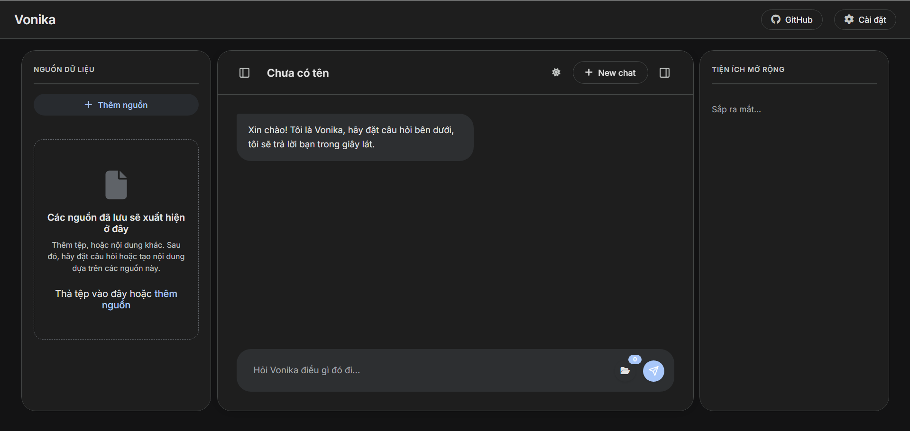
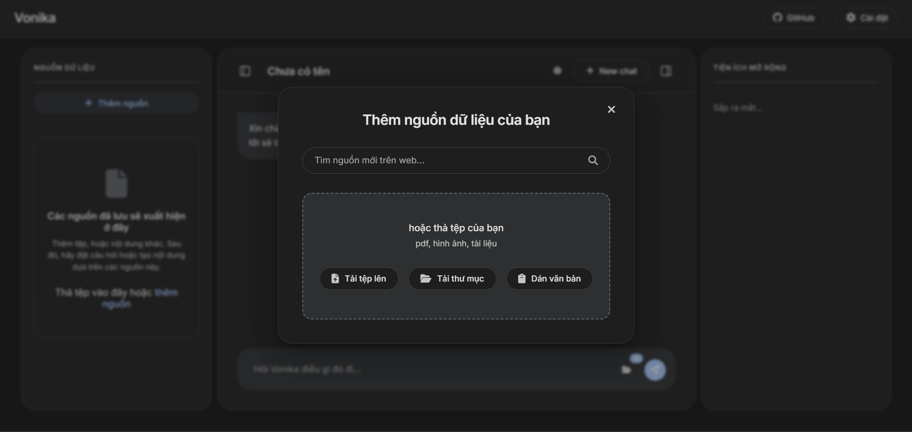
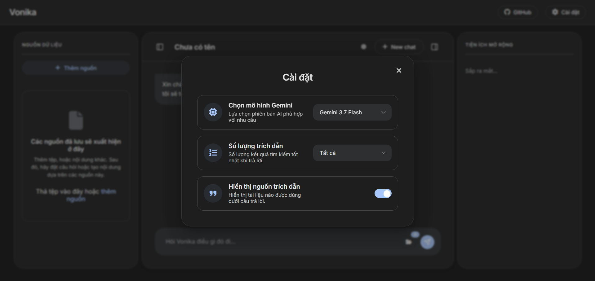
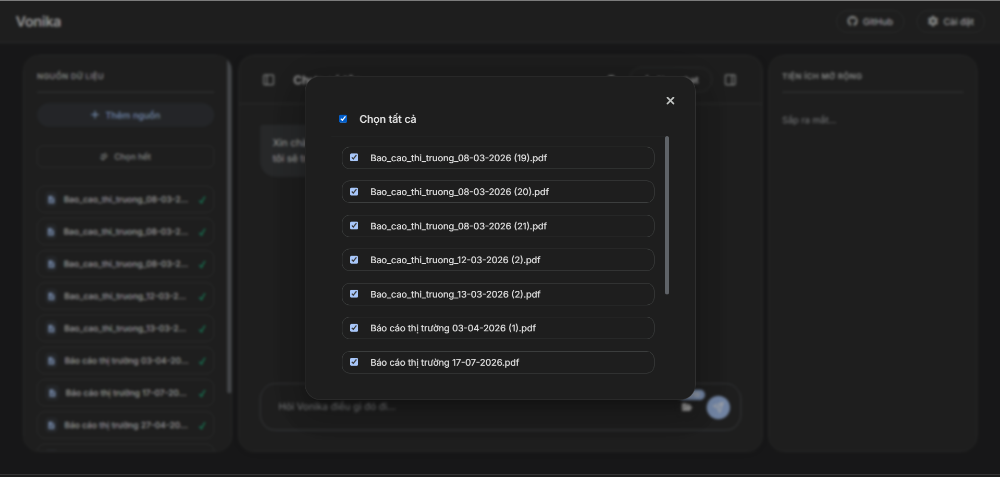

# Vonika — AI Chat Assistant with Document RAG

**Vonika** is a full-stack chat application that lets users upload their own documents (PDF, Word, Excel, CSV, JSON, Markdown...) and ask questions grounded in that content. It combines a hand-built hybrid retrieval engine (BM25 + TF-IDF with Reciprocal Rank Fusion) tuned for Vietnamese text with a FastAPI backend and a vanilla JS/Supabase frontend.

I built this to understand retrieval-augmented generation from the ground up — not just call an embeddings API, but implement and tune the ranking logic myself, and see where a lightweight hybrid-search approach holds up (and where it doesn't) compared to pure vector search.

**[Live Demo](https://vonika.pages.dev/)** ·
**[Screenshots below](#screenshots)** ·
**Built by [Vo Phuc Minh Tam (MTamVP)]**

---

## Screenshots
**Giao diện chat**


**Giao diện tải file**


**Giao diện Settings**


**Giao diện chọn file thông minh**

---

## Why hybrid search instead of pure embeddings?

Most RAG tutorials reach straight for a vector database. I chose BM25 (exact keyword/term matching) fused with TF-IDF cosine similarity instead, for two reasons:

- **Vietnamese retrieval is sensitive to exact terms** — legal/technical phrasing, names, and numbers often matter more than semantic similarity, and BM25 handles that better out of the box.
- **Cost and hosting constraints** — running on a free-tier host with no GPU ruled out hosting my own embedding model, and I wanted to avoid paying for an embeddings API for this project.

Scores from both algorithms are combined using Reciprocal Rank Fusion (`1 / (60 + rank)`), which is more robust than simple score averaging when the two methods score on different scales.

---

## How it works

1. **Upload** — user uploads a document (or pastes text). Files are parsed based on type (`pandas`/`tabulate` for spreadsheets, `pypdf` for PDFs, `python-docx` for Word, etc.) and converted to plain text.
2. **Chunk** — text is split into ~800-character chunks with `RecursiveCharacterTextSplitter` and stored in Supabase.
3. **Retrieve** — on a query, Vietnamese text is tokenized with `underthesea` and normalized, then scored by BM25 and TF-IDF in parallel; the top results are fused via RRF.
4. **Generate** — the top ~5 chunks are injected into a prompt with conversation history and sent to Gemini, which is instructed to answer strictly from context and suggest follow-up questions.

```
Upload → Parse → Chunk → Store (Supabase)
                              ↓
Query → Tokenize → BM25 ┐
                 → TF-IDF ┴→ RRF fusion → Top-k chunks → Gemini → Answer
```

---

## Features

- Multi-format upload: PDF, DOCX, TXT, JSON, XLSX, CSV, TSV, MD — via file picker, folder upload, drag-and-drop, or paste
- Per-message file selection: attach only the documents relevant to a given question
- Persistent chat history with auto-generated (and editable) titles
- Light/dark theme, resizable/collapsible sidebars, responsive layout

---

## Tech Stack

| Layer | Tools |
|---|---|
| Frontend | HTML5, CSS3, vanilla JavaScript (ES6+) |
| Backend | Python, FastAPI, Uvicorn |
| Retrieval | Rank-BM25, scikit-learn (TF-IDF), underthesea (Vietnamese NLP) |
| Generation | Google Gemini API |
| Parsing | pandas, openpyxl, tabulate, pypdf, python-docx |
| Data | Supabase (PostgreSQL + Storage) |
| Hosting | Render (free tier) |

---

## Running it locally

```bash
# Backend
cd rag_server
pip install -r requirements.txt
# add your Supabase and Gemini API keys to .env — see .env.example
uvicorn main:app --reload

```

_(Fill in actual env vars, ports, and any Supabase table setup steps needed to get a fresh clone running.)_

---

## Database Schema

- `chat_messages` — chat history (`id`, `role`, `content`, `chat_title`, `created_at`)
- `uploaded_files` — file metadata (`id`, `file_name`, `file_url`, `created_at`)
- `document` — chunked text per file (`id`, `file_id`, `chunk_index`, `content`)
- `chat-files` (Storage bucket) — raw uploaded files

---

## Limitations & Next Steps

- No retrieval evaluation yet — next step is a small labeled test set to measure precision/recall of the fused ranking, and compare against a pure-embedding baseline.
- BM25/TF-IDF is fast but won't catch pure semantic matches (paraphrased questions with no shared keywords); worth testing a lightweight embedding model as a third signal.
- Free-tier hosting caps concurrent usage and memory — noted as a constraint, not yet load-tested.

---
